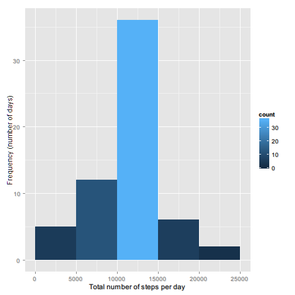

This file contains the solution to the first project in the Reproducible Research course

###Part I: number of steps per day

```r
library(data.table)
library(plyr)
library(ggplot2)
dataset<-fread("activity.csv")
goodsteps<-subset(dataset, subset = !is.na(steps))
goodsteps$date<-as.Date(goodsteps$date)
# summarize the number of steps (exclude the records missing data)
steps<-ddply(goodsteps, .(date), summarise, sum(steps))
colnames(steps)<-c("Date", "Sum")
```

1. A histogram showing the distribution of the total number of steps per day
 
2. The mean and median of the total of steps taken per day

      the mean is 10766.19 and the median is 10765.00

###Part II: average daily pattern

1. Time series plot of the 5-minute intervals and number of steps taken, averaged across all days

```r
intervalSteps<-(ddply(goodsteps, .(interval), summarize, steps=mean(steps)))
```
 

2. Finding the index of the 5-minute interval that contains the maximum number of steps

      the 5-minute interval that on average across all the days in the dataset, contains the maximum number of steps is 835
      
###Part III: Inputting missing values

```r
nmissingvalues<-nrow(dataset[is.na(steps)])
```
1. The number of missing values is 2304
2. Filling the missing values with the average for that day

```r
# create a set with missing data from the original set
datasetwna<-dataset       
datasetwna$date<-as.Date(datasetwna$date)
# make the number of steps numeric to be able to hold the average
datasetwna$steps<-as.numeric(datasetwna$steps)
# join with the average number of steps/interval
x<-merge(x=datasetwna, y=intervalSteps, by="interval", all=T)
# create a new column to hold the fixed steps
x$steps<-x$steps.x
# replace na's with the average number of steps
x$steps[is.na(x$steps.x)]<-x$steps.y[is.na(x$steps.x)]
# repeat the calculations from the first part
fixedsteps<-ddply(x, .(date), summarise, sum(steps))
# fix the column names
colnames(fixedsteps)<-c("Date", "Sum")
```

Plot the number of steps with filled in data

 

2. The mean and median of the total of steps taken per day

      the mean of the fixed set is 10766.19 and the median is 10766.19
      
      the number of days with steps between 10 and 15k has increased to over 30, but the mean and the median have remained the same

### Part IV: Are there differences in activity patterns between weekdays and weekends

```r
# using the dataset with the number of steps fixed up
x$weekday<-ifelse(weekdays(x$date)!="Saturday" & weekdays(x$date)!="Sunday", "Weekday", "Weekend")
intervalSteps<-(ddply(x, .(interval, weekday), summarize, steps=mean(steps)))
```

 

The graphs show that the weekend and weekday profiles have a similar distribution, with slightly increased activity during the weekend; the activity is more concentrated at the beginning of the day. In the weekend the activity is more spread out during the day 
